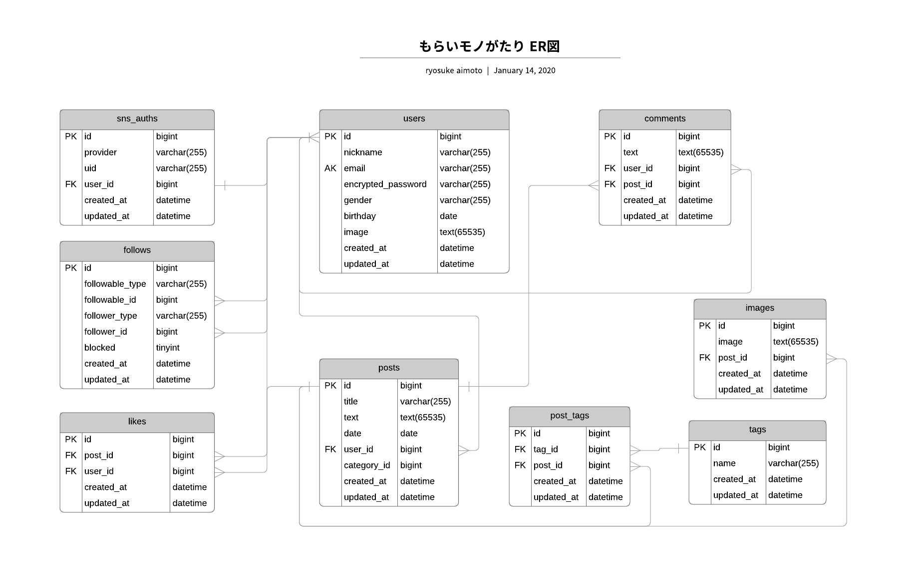

## ・アプリケーションの概要
### 他人からプレゼントでもらったものを、自身の体験やもらったシチュエーションと一緒に紹介するwebアプリケーション
### https://www.redemptionstory.site/
#### アカウント：aaa@abc.com
#### パスワード：a12345

## ・機能・技術一覧
※より詳細な説明は[こちら](http://urx3.nu/wxms)

|機能|主な技術|
|-|-|
|データベース|mysql|
|サーバー|AWS EC2、unicorn、nginx|
|ssl証明|AWS ACM、ELB、Route53|
|デプロイ|gem "capistrano"、自動デプロイ|
|サインアップ、ログイン機能|gem "devise", usersテーブル|
|SNS認証|gem "omniauth","omniauth-google-oauth2","omniauth-facebook"|
|ユーザー編集機能|gem "devise"|
|ユーザーフォロー機能|gem "acts_as_follower|
|商品投稿、編集機能|postsテーブル、accepts_nested_attributes_for、active_hash、JavaScript|
|タグ登録機能|JavaScript|
|画像投稿機能|gem "carrierwave"、AWS S3、JavaScript|
|楽天商品検索機能|gem "rakuten_web_service"、JavaScript 楽天画像の引用機能|
|商品検索機能|scope|
|商品いいね機能|JavaScript 非同期通信|
|商品コメント機能|JavaScript 非同期通信|
|ユーザーフォロー機能|gem "acts_as_follower"、JS 非同期通信)|
|単体テスト(model,controller)|gem "rspec-rails"|

## ・データベース

## ・開発環境
#### Ruby 2.5.1
#### Rails 5.2.3
#### Mysql 5.7
